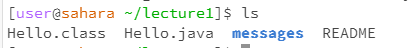
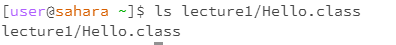
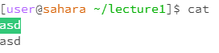
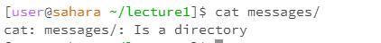
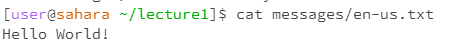

# Lab 1 Blog
Showing the three commands of filesystem commands

## Code for CD

### Without argument:
```
    [user@saharra ~]pwd
    /home
    [user@saharra ~]cd
        
    [user@saharra ~]pwd
    /home
```
Results:    
    

Note:
    Nothing changed, no directory change. Nothing changed because we didnt specify a directory which the cd could change the directory into.


&nbsp;
&nbsp;
&nbsp;


### Path to a directory as an argument:
```
    >[user@saharra ~]pwd
    >/home
    >[user@saharra ~]cd lecture1/
    >
    >[user@saharra ~/lecture1]pwd
    >/home/lecture1
```
Results:    
    

Note:
    Directory changed to the argument directory. Directory changed to the relative path specified from the working directory. 


&nbsp;
&nbsp;
&nbsp;


### Path to a file as an argument:
```
    >[user@saharra ~/lecture1]pwd
    >/home/lecture1
    >[user@saharra ~/lecture1]cd lecture1/en-us.txt
    >bash: cd: messages/en-us.txt: Not a directory
```
Results:    
    

Note:
    Directory cannot be changed to a file, throws an error. This is because cd changes directory, but a file is not a working directory.


&nbsp;
&nbsp;
&nbsp;


## Code for LS

### No argument:
```
    >[user@saharra ~/lecture1]ls
    >Hello.class  Hello.java  messages  README
```
Results:    
    

Note:
    Shows the next level files on the current directory. Shows what files/directories are in your working directory.


&nbsp;
&nbsp;
&nbsp;


### Path to a directory as an argument:
```
    >[user@saharra ~/] ls lecture1/messages/
    >en-us.txt  es-mx.txt  zh-cn.txt
```
Results:    
    

Note:
    LS shows the fils in the working directory of the path you ls into. It will show you what files are in those directories.


&nbsp;
&nbsp;
&nbsp;


### Path to a file as an argument:
```
    >[user@saharra ~/]ls lecture1/Hello.class
    >lecture1/Hello.class
   
```
Results:    
    

Note:
    Shows the directory to the file. It will only show the file because the file is not a directory and there is nothing more down there.


&nbsp;
&nbsp;
&nbsp;


## Code for cat

### No argument:
```
    >[user@saharra ~/lecture1]cat
    >asd
    >asd
```
Results:    
    

Note:
    Does nothing, you can type more and it will repeat whatever you input. This is because you are not specifying what you want the cat to show, so it will just show what you type. 


&nbsp;
&nbsp;
&nbsp;


### Path to a directory as an argument:
```
    >[user@saharra ~/lecture1]cat messages/
    >cat: messages/: Is a directory
```
Results:    
    

Note:
    Cat will tell you that this is a directory and nothing more. Cat will show file content but not if you input a directory, it will just simply say that it is a directory.


&nbsp;
&nbsp;
&nbsp;


### Path to a file as an argument:
```
    >[user@saharra ~/lecture1]cat messages/en-us.txt
    >Hello World!
```
Results:    
    

Note:
    Prints the contents of the file. Cat will print the contents of the file you specify the path to. 


&nbsp;
&nbsp;
&nbsp;

