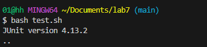
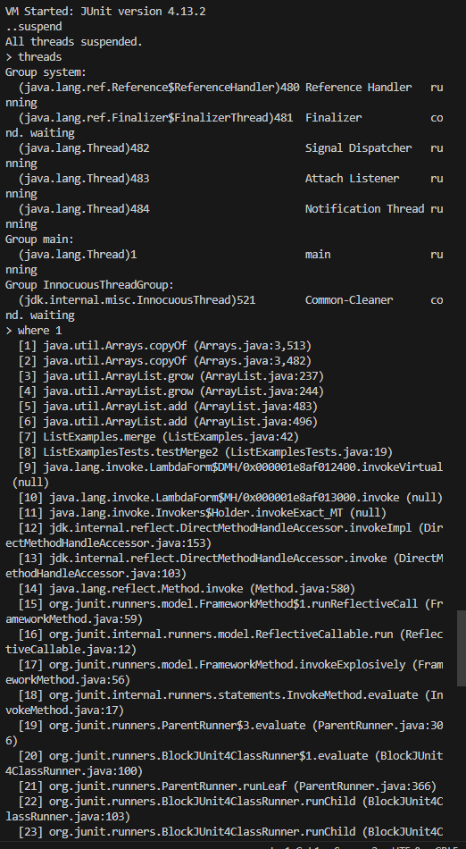
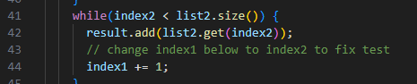
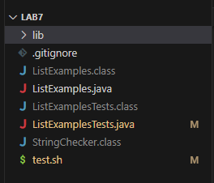

# Lab 5 Blog
Design a debugging scenario, and write your report as a conversation on EdStem. 

## Part 1

### Initial Post:

    
    Student: Hello, when I run the test.sh file for lab7 to run some tests on the the implementation of ListExamples the test would never end. It would never give me a result and I'm guessing that the program is stuck in an infinite loop but I have no idea where it is stuck since it would never give me a result. I tried using jdb but it would also just be stuck in an infinite loop. 

### TA Response:    
    TA: Hello, you are on the right path, there are a few commands in jdb that will allow you to troubleshoot the problem you are dealing with. Is there a command that allows you to find out where you are in the thread that is executing infinitely? Is there a command that allows you to freeze the thread temporarily so you can identify what the bug is. 

### Student Response:

    Student: Thanks, I found the commands suspend which allowed me to freeze the program once it fell into the infinite loop. I was then able to use threads to find the thread of the Main, which using where, also told me that the error was in line 42 of ListExamples. Looking more deeply at that method I found that the incrementer index2 was mistakenly spelled as index1 which caused the while loop to never end causing the bug. 

### Setup with this debugging scenario
Directory structure needed:

Code for ListExamples.java (before bug fix)

    import java.util.ArrayList;
    import java.util.List;

    interface StringChecker { boolean checkString(String s); }

    class ListExamples {

    // Returns a new list that has all the elements of the input list for which
    // the StringChecker returns true, and not the elements that return false, in
    // the same order they appeared in the input list;
    static List<String> filter(List<String> list, StringChecker sc) {
        List<String> result = new ArrayList<>();
        for(String s: list) {
        if(sc.checkString(s)) {
            result.add(0, s);
        }
        }
        return result;
    }

    // Takes two sorted list of strings (so "a" appears before "b" and so on),
    // and return a new list that has all the strings in both list in sorted order.
    static List<String> merge(List<String> list1, List<String> list2) {
        List<String> result = new ArrayList<>();
        int index1 = 0, index2 = 0;
        while(index1 < list1.size() && index2 < list2.size()) {
        if(list1.get(index1).compareTo(list2.get(index2)) < 0) {
            result.add(list1.get(index1));
            index1 += 1;
        }
        else {
            result.add(list2.get(index2));
            index2 += 1;
        }
        }
        while(index1 < list1.size()) {
        result.add(list1.get(index1));
        index1 += 1;
        }
        while(index2 < list2.size()) {
        result.add(list2.get(index2));
        // change index1 below to index2 to fix test
        index1 += 1;
        }
        return result;
    }
    }

Code for ListExamplesTests.java (before bug fix)

    import static org.junit.Assert.*;
    import org.junit.*;
    import java.util.*;
    import java.util.ArrayList;

    public class ListExamplesTests {
        @Test
        public void testMerge1() {
                List<String> l1 = new ArrayList<String>(Arrays.asList("x", "y"));
            List<String> l2 = new ArrayList<String>(Arrays.asList("a", "b"));
            assertArrayEquals(new String[]{ "a", "b", "x", "y"}, ListExamples.merge(l1, l2).toArray());
        }
        
        @Test
            public void testMerge2() {
            List<String> l1 = new ArrayList<String>(Arrays.asList("a", "b", "c"));
            List<String> l2 = new ArrayList<String>(Arrays.asList("c", "d", "e"));
            assertArrayEquals(new String[]{ "a", "b", "c", "c", "d", "e" }, ListExamples.merge(l1, l2).toArray());
            }

    }

Code for test.sh (before bug fix)

    javac -g -cp ".;lib/hamcrest-core-1.3.jar;lib/junit-4.13.2.jar" *.java
    java -cp ".;lib/hamcrest-core-1.3.jar;lib/junit-4.13.2.jar" org.junit.runner.JUnitCore ListExamplesTests

Command Lines used to trigger the bug

    bash test.sh

    or

    jdb -classpath ".;lib/hamcrest-core-1.3.jar;lib/junit-4.13.2.jar" org.junit.runner.JUnitCore ListExamplesTests

    run 

What was used to fix the bug:

    Change ListExamples.java

    while(index2 < list2.size()) {
        result.add(list2.get(index2));
        // change index1 below to index2 to fix test
        index1 += 1;
    }

    to 

    while(index2 < list2.size()) {
        result.add(list2.get(index2));
        // change index1 below to index2 to fix test
        index2 += 1;
    }

## Part 2

Insight: 
    
In the second half of this quarter, I delved into the intricacies of debugging Java programs using jdb and the concept of suspension. Learning how to effectively use jdb for pinpointing issues in my code has been an invaluable skill, providing insights into the execution flow and aiding in identifying and resolving bugs. Moreover, discovering the power and versatility of Vim as a text editor during this lab experience has significantly improved my coding efficiency and control over the editing process. These insights not only enhance my technical capabilities but also underscore the importance of mastering diverse tools to become a more proficient programmer.