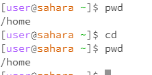
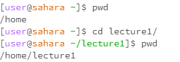
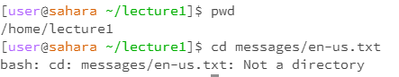

# Lab 1 Blog
Showing the three commands of filesystem commands

Code for CD

Without argument:
```
    [user@saharra ~]pwd
    /home
    [user@saharra ~]cd
        
    [user@saharra ~]pwd
    /home
```
Results:    
    

Note:
    Nothing changed, no directory change


&nbsp;
&nbsp;
&nbsp;


Path to a directory as an argument:
```
    >[user@saharra ~]pwd
    >/home
    >[user@saharra ~]cd lecture1/
    >
    >[user@saharra ~/lecture1]pwd
    >/home/lecture1
```
Results:    
    

Note:
    Directory changed to the argument directory 


&nbsp;
&nbsp;
&nbsp;


Path to a file as an argument:
```
    >[user@saharra ~/lecture1]pwd
    >/home/lecture1
    >[user@saharra ~/lecture1]cd lecture1/en-us.txt
    >bash: cd: messages/en-us.txt: Not a directory
```
Results:    
    

Note:
    Directory cannot be changed to a file, throws an error