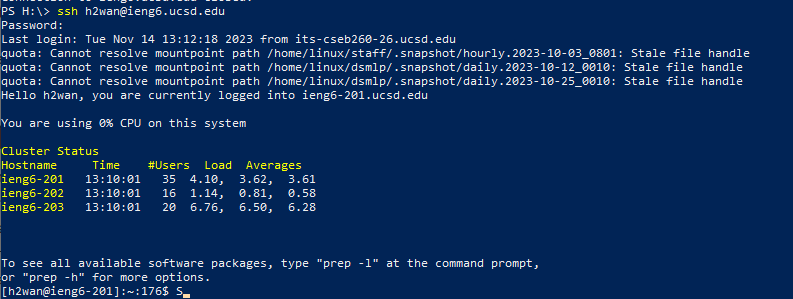
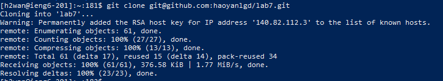
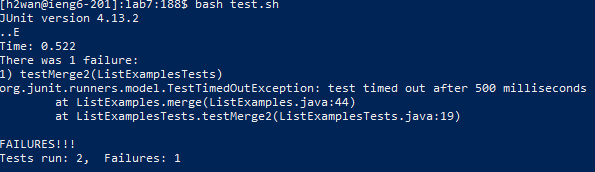
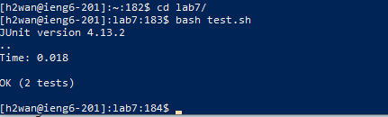
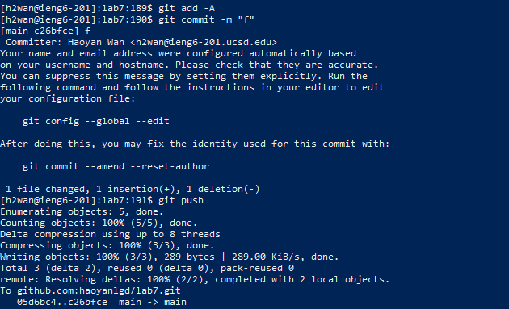

# Lab 4 Blog
Showing the steps to editing via vim

4 Log into ieng6
5 Clone your fork of the repository from your Github account
6 Run the tests, demonstrating that they fail
7 Edit the code file ListExamples.java to fix the failing test (as a reminder, the error in the code is just that index1 is used instead of index2 in the final loop in merge)
8 Run the tests, demonstrating that they now succeed
9 Commit and push the resulting change to your Github account

## Step 4 
Results:    
    
### keys pressed to get there:
```
ssh h2wan@ieng6.ucsd.edu <enter> myPassWord! <enter>
```
Summarize what commands were used:
    The command I ran was ssh which will connect me remotely to the machine on ieng6, the two enter key presses were to enter the command and my password subsequently.


## Step 5 
Results:    
    
### keys pressed to get there:
```
git clone git@github.com:haoyanlgd/lab7.git <enter>
```
Summarize what commands were used:
    The command I used was git clone which creates a copy of the github repository on my local machine. The link was the ssh link given to me on github and the enter key was used to enter the command. 


## Step 6 
Results:    
    
### keys pressed to get there:
```
cd l <tab> <enter> bash test.sh <enter>
```
Summarize what commands were used:
    I used to cd command to change the directory into the directory where the test file is at. I used tab to autocomplete the lab7 directory and I used enter to enter the commands. I used bash to run the test file test.sh and enter to enter that command. 


## Step 7 
Results:    
    
### keys pressed to get there:
```
    vim L <tab> .java <enter> i <right> <backspace> 2 <esc> :wq! <enter>
```
Summarize what commands were used:
    I used the vim command to edit the file in vim. I used tab to autocomplete ListExamples then I wrote .java and pressed enter to enter the command. I then pressed i to enter insert mode in vim, I used right arrow key to get to the location i want to edit then pressed backspace to delete the 1 then replaced it with 2. I then pressed escape to enter command mode where I typed :w1! to exit and save. I pressed enter to enter that command. 


## Step 8 
Results:    
    
### keys pressed to get there:
```
    bash test.sh <enter>
```
Summarize what commands were used:
    I used the bash command to run the test.sh file which compiles and runs the tests. Then I used enter key to enter that command. 


## Step 9 
Results:    
    
### keys pressed to get there:
```
    git add -A <enter> git commit -m "f" <enter> git push <enter>
```
Summarize what commands were used:
    I first used the git add command which adds the changes to the local main branch, I then pressed enter to enter that command. I then used the commit command which creates a new commit for my local git repository with an option -m which adds a commit message, I pressed enter to enter that command. I then used the git push command, which pushes the changes in my local repository to the one hosted on github. I pressed enter key to enter that command. 