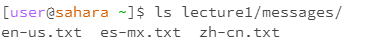

# Lab 1 Blog
Showing the three commands of filesystem commands

## Code for CD

### Without argument:
```
    [user@saharra ~]pwd
    /home
    [user@saharra ~]cd
        
    [user@saharra ~]pwd
    /home
```
Results:    
    

Note:
    Nothing changed, no directory change. Nothing changed because we are already in the home directory. CD with no arguments in another directory that is not the home directory would change the working directory to the home directory.


&nbsp;
&nbsp;
&nbsp;


### Path to a directory as an argument:
```
    >[user@saharra ~]pwd
    >/home
    >[user@saharra ~]cd lecture1/
    >
    >[user@saharra ~/lecture1]pwd
    >/home/lecture1
```
Results:    
    

Note:
    Directory changed to the argument directory. Directory changed to the relative path specified from the working directory. 


&nbsp;
&nbsp;
&nbsp;


### Path to a file as an argument:
```
    >[user@saharra ~/lecture1]pwd
    >/home/lecture1
    >[user@saharra ~/lecture1]cd lecture1/en-us.txt
    >bash: cd: messages/en-us.txt: Not a directory
```
Results:    
    

Note:
    Directory cannot be changed to a file, throws an error. This is because cd changes directory, but a file is not a working directory.


&nbsp;
&nbsp;
&nbsp;


## Code for LS

### No argument:
```
    >[user@saharra ~/lecture1]ls
    >Hello.class  Hello.java  messages  README
```
Results:    
    

Note:
    Shows the immediate subdirectories or files that are in your current working directory. Without arguments it shows what files or directories are avalible in your current working directory. 


&nbsp;
&nbsp;
&nbsp;


### Path to a directory as an argument:
```
    >[user@saharra ~/] ls lecture1/messages/
    >en-us.txt  es-mx.txt  zh-cn.txt
```
Results:    
    

Note:
    LS shows the fils and directories in the working directory of the path you ls into. It will show you what files and directories are in those directories.


&nbsp;
&nbsp;
&nbsp;


### Path to a file as an argument:
```
    >[user@saharra ~/]ls lecture1/Hello.class
    >lecture1/Hello.class
   
```
Results:    
    

Note:
    Shows the directory to the file. It does not produce an error because when inputing a file name to LS, it will act as a filter to find that file in that directory to display it if it exists. Or else it will just result in an error.


&nbsp;
&nbsp;
&nbsp;


## Code for cat

### No argument:
```
    >[user@saharra ~/lecture1]cat
    >asd
    >asd
```
Results:    
    

Note:
    It is not an error Instead, it waits for input from standard input (typically the keyboard). By default, without any arguments, cat reads from standard input. This means you can start typing directly into the terminal, and it will echo what you type after you press Enter. To exit the mode, simply press the keybind according to your operating system. 


&nbsp;
&nbsp;
&nbsp;


### Path to a directory as an argument:
```
    >[user@saharra ~/lecture1]cat messages/
    >cat: messages/: Is a directory
```
Results:    
    

Note:
    When you use cat with a directory as an argument, it will produce an error because cat is designed to read and concatenate file content, not directories. The error message will tell you that it is a directory. 


&nbsp;
&nbsp;
&nbsp;


### Path to a file as an argument:
```
    >[user@saharra ~/lecture1]cat messages/en-us.txt
    >Hello World!
```
Results:    
    

Note:
    Prints the contents of the file. Cat will print the contents of the file you specify the path to. 


&nbsp;
&nbsp;
&nbsp;

